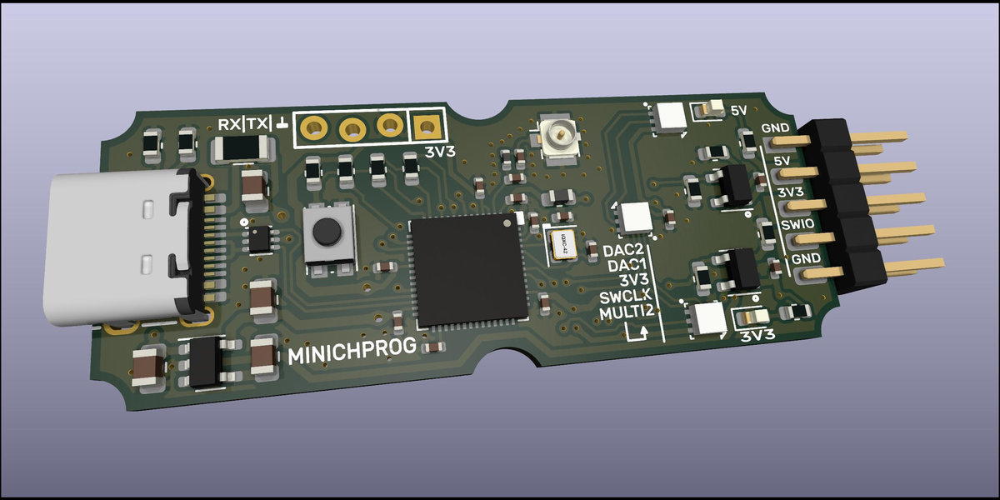
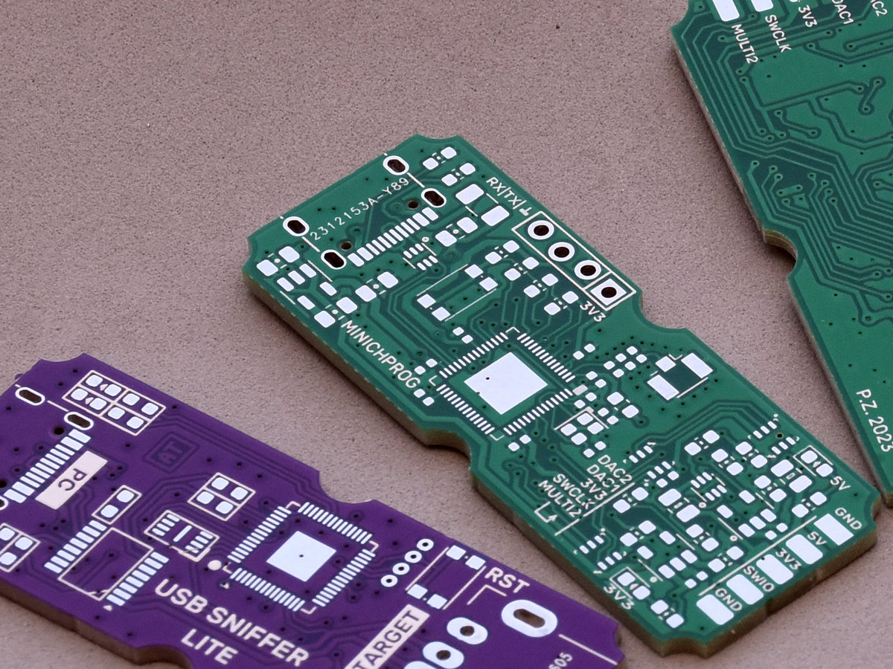
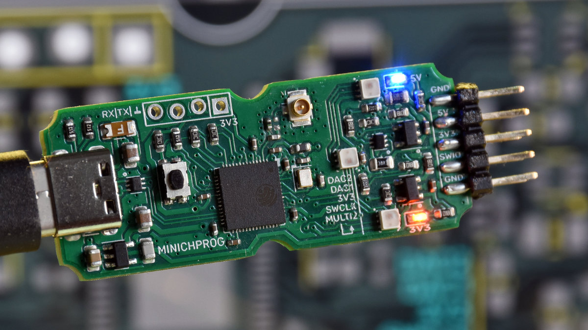
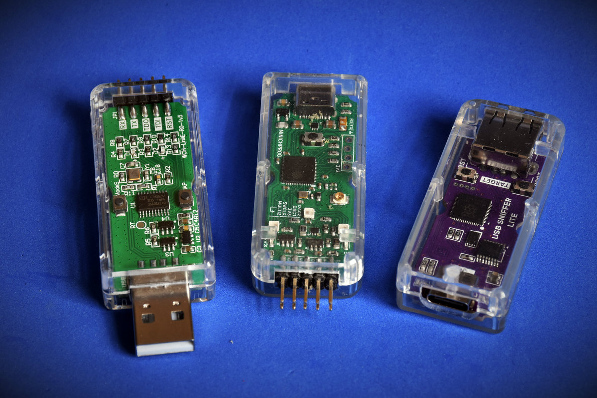

# Minichprog
### ESP32-S2 based programmer/debugger for the WCH CH32V003 series MCU.  
  
Hardware compatible with CNLohr's ESP32-S2 ch32v003 programmer:  
https://github.com/cnlohr/cnhardware/tree/master/esp32s2-funprog  
Firmware and flashing instructions availble here:  
https://github.com/cnlohr/esp32s2-cookbook/tree/master/ch32v003programmer

Differences:
- 500mA polyfuse on the VBUS rail
- USB protection IC
- Current limited power switches
- 5V and 3.3V present led indicators
- smaller footprint, fits into the "USB dongle" 
  acrylic enclosure (same as original WCHLinkE)
- U.FL connector for external WiFI antenna

PCB is 4 layer, designed using KiCAD7. Gerbers in ZIP file are included as well as HTML BOM.  

--- 
Pictures below show rev A, which had additional target discharge option. It was not necessary since the BL2555 power switches have that feature built in.

  

---  
PCB is designed to fit into one of those transparent "USB" enclosures, the same the original WCHLinkE programmer is using.  
  

------
(c) 06.2023 by Piotr Zapart  
www.hexefx.com 
